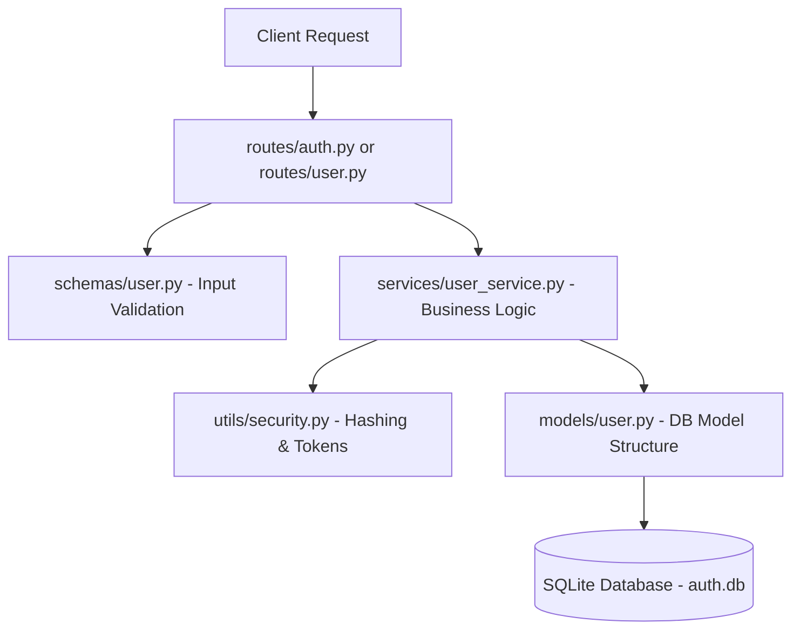

# FastAPI JWT Authentication System

Welcome! This repository implements a modular, secure, and clean authentication system built with **FastAPI**, **SQLAlchemy (SQLite)**, and **JSON Web Tokens (JWT)**.

This document is designed to help you understand the architecture, the code structure, and how each component works, even if you are new to backend development.

---

## 📂 Project Directory Structure

We organized the application from a flat structure into a modular one to enforce a **Separation of Concerns**. Each folder has a single, well-defined responsibility:

```
fastapi-auth-proj/
├── config/
│   └── database.py          # Database configuration, engine, and session setup.
├── models/
│   └── user.py              # SQLAlchemy database model defining the 'users' table.
├── schemas/
│   └── user.py              # Pydantic schemas for validating incoming request bodies.
├── services/
│   └── user_service.py      # Core business logic (user registration, validation, login logic).
├── utils/
│   └── security.py          # Cryptography helpers (password hashing and JWT token creation).
├── routes/
│   ├── auth.py              # Authentication endpoints (/register, /login).
│   └── user.py              # Protected user endpoints (/profile, /users).
├── app.py                   # Main FastAPI application entrypoint.
├── main.py                  # Backward-compatible run wrapper.
└── requirements.txt         # Clean, pinned project dependencies.
```

---

## 🔄 Architectural Flow (How a Request Works)

When a client (e.g., a frontend app or browser) makes a request to the server, it travels through the layers of our application in a structured sequence:



1. **Client** makes an HTTP request (e.g., `POST /register` with user details).
2. The **Router** (`routes/auth.py`) receives the request.
3. The **Schema** (`schemas/user.py`) validates the incoming JSON data. If the email is invalid or missing fields, FastAPI automatically returns a `422 Unprocessable Entity` error.
4. The router passes the validated data to the **Service** (`services/user_service.py`), which coordinates the database operations.
5. The **Service** uses **Security** utilities (`utils/security.py`) to hash the plain text password.
6. The service saves a database row formatted according to the **Model** (`models/user.py`) into the **SQLite database**.

---

## 📝 Code Walkthrough (Layer-by-Layer)

### 1. Database Configuration (`config/database.py`)
This file configures the connection to our SQLite database (`auth.db`).
* **`engine`**: The connection pool that manages database connections.
* **`SessionLocal`**: A factory for generating database sessions. Whenever we read/write to the database, we use a session.
* **`Base`**: The base class that all database models inherit from. It registers models with the SQLAlchemy engine.
* **`get_db()`**: A helper function (generator) that provides a database session to a route, and guarantees that the session is closed automatically once the request completes.

### 2. Database Models (`models/user.py`)
Models represent the structure of tables inside our database.
* The `User` class inherits from `Base` and maps directly to the `users` table in SQLite.
* It defines the database column names, data types (`Integer`, `String`), and constraints (`unique=True` for emails, `primary_key=True` for IDs).

### 3. Request/Response Validation (`schemas/user.py`)
Schemas (built using **Pydantic**) define what the client is allowed to send or receive.
* **`UserCreate`**: Expects `name`, `email`, and `password` when a user registers.
* **`UserLogin`**: Expects only `email` and `password` when logging in.
* Pydantic automatically parses JSON strings from request bodies into Python objects.

### 4. Cryptography & Utilities (`utils/security.py`)
Handles secure user credential management.
* **`pwd_context`**: Configures the **bcrypt** hashing algorithm. We never store plain text passwords in the database for security reasons.
* **`hash_password(password)`**: Takes a plain-text password and hashes it into an undecipherable string (e.g., `testpassword` becomes `$2b$12$...`).
* **`verify_password(plain, hashed)`**: Checks if a plain-text password matches the stored hash.
* **`create_access_token(data)`**: Generates a JSON Web Token (JWT) with an expiration time of 1 hour. This token acts as a digital signature verifying the user is logged in.

### 5. Business Logic Service (`services/user_service.py`)
Contains the core operations of the application, keeping controllers/routers clean and readable.
* **`register_user`**: Queries the database to check if the email already exists. If not, hashes the password and saves the new user record.
* **`authenticate_user`**: Looks up the user by email, verifies their password hash, and returns the user object if valid (or throws an HTTP 400 error).
* **`get_all_users`**: Queries and returns all user rows.

### 6. API Routing (`routes/auth.py` and `routes/user.py`)
Routers map URLs to Python functions.
* **[routes/auth.py](file:///d:/auth-proj/my-new-project/fastapi-auth-proj/routes/auth.py)**: Handles authentication routes `/register` and `/login`.
* **[routes/user.py](file:///d:/auth-proj/my-new-project/fastapi-auth-proj/routes/user.py)**: Handles user information routes `/profile` and `/users`.
* Keeps code modular so that as you add more features, you don't end up with a single, massive endpoint file.

---

## 🚀 How to Run the Application

### 1. Set Up Your Virtual Environment
To ensure you use the correct dependency versions, activate the project's virtual environment:

* **Windows (PowerShell)**:
  ```powershell
  .\venv\Scripts\Activate.ps1
  ```
* **macOS / Linux**:
  ```bash
  source venv/bin/activate
  ```

### 2. Install Project Dependencies
Run this command to install the required libraries:
```bash
pip install -r requirements.txt
```

### 3. Run the Development Server
Start the server using uvicorn:
```bash
uvicorn main:app --reload
```
* The server will start on `http://127.0.0.1:8000`.
* The `--reload` flag tells Uvicorn to watch for file changes and restart automatically when you edit code.

---

## 🛠️ API Reference

You can view the interactive API documentation directly in your browser at:
👉 **`http://127.0.0.1:8000/docs`** (Swagger UI)

### Endpoints
| HTTP Method | Endpoint | Description | Public / Private |
| :--- | :--- | :--- | :--- |
| **POST** | `/register` | Register a new user | Public |
| **POST** | `/login` | Authenticate credentials and get a JWT token | Public |
| **GET** | `/profile` | Access the user profile page | Private (Mock) |
| **GET** | `/users` | Get a list of all registered users | Public |
